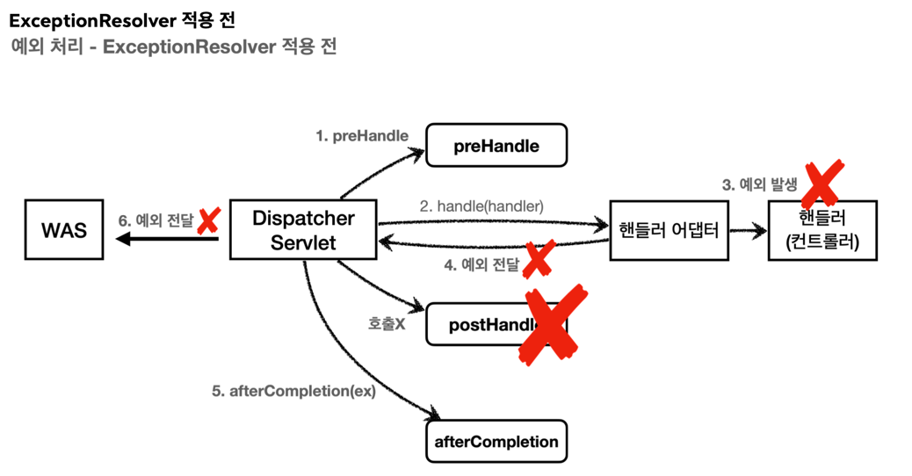
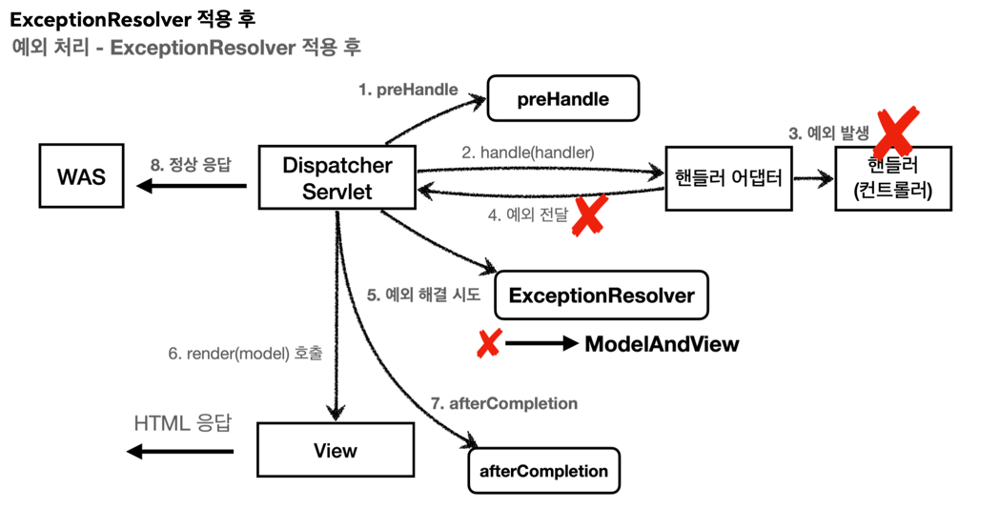

# 03.09 공부기록  
## 서블릿 예외 처리  
- Exception(예외)
- response.sendError(Http 상태 코드, 오류 메시지)

예외 발생 흐름  
`
WAS(여기까지 전파) <- 필터 <- 서블릿 <- 인터셉터 <- 컨트롤러(예외발생)
`  

sendError 흐름  
`
WAS(sendError 호출 기록 확인) <- 필터 <- 서블릿 <- 인터셉터 <- 컨트롤러
(response.sendError())
`

예외 발생과 오류 페이지 요청 흐름  
```
1. WAS(여기까지 전파) <- 필터 <- 서블릿 <- 인터셉터 <- 컨트롤러(예외발생)
2. WAS `/error-page/500` 다시 요청 -> 필터 -> 서블릿 -> 인터셉터 -> 컨트롤러(/error-page/500) -> View
```  
&rarr; 예외가 발생되어 WAS까지 전파된 후 WAS는 오류페이지 경로를 찾아 오류페이지를 호출하며 
이때, 서블릿, 인터셉터, 컨트롤러가 모두 다시 호출된다.  
서버 내부에서 오류페이지를 호출하며 필터와 인터셉터를 한번 더 호출하는건 비효율적이기에 해결하기 위해 *DispatcherType*이라는 추가정보를 활용  

### DispatcherType  
`REQUEST` : 클라이언트 요청  
`ERROR` : 오류 요청  
`FORWARD` : MVC에서 배웠던 서블릿에서 다른 서블릿이나 JSP를 호출할 때 `RequestDispatcher.forward(request, response);`  
`INCLUDE` : 서블릿에서 다른 서블릿이나 JSP의 결과를 포함할 때 `RequestDispatcher.include(request, response);`  
`ASYNC` : 서블릿 비동기 호출  

### Filter에서 중복 호출   
`
filterRegistrationBean.setDispatcherTypes(DispatcherType.REQUEST, DispatcherType.ERROR);
`  
두 가지를 모두 넣으면 클라이언트 요청과 에러페이지 요청에도 필터가 호출된다.  
기본 값은 DispatcherType.REQUEST로 에러페이지 요청에 필터를 호출할게 아니라면 기본값으로 사용  

### 인터셉터에서 중복 호출  
```
registry.addInterceptor(new LogInterceptor())
            .order(1)
            .addPathPatterns("/**")
            .excludePathPatterns("/css/**", "*.ico", "/error", "/error-page/**");   //오류 페이지 경로 제외
```  
**인터셉터는 서블릿에서 제공하는게 아닌 스프링에서 제공하는 기능**으로 DispatcherType과 무관하게 무조건 호출된다.  
그러므로 에러페이지 경로에는 excludePathPatterns에 추가하여 호출되지 않도록 설정  

### 전체 흐름 정리  
```
1. WAS(/error-ex, dispatchType=REQUEST) -> 필터 -> 서블릿 -> 인터셉터 -> 컨트롤러
2. WAS(여기까지 전파) <- 필터 <- 서블릿 <- 인터셉터 <- 컨트롤러(예외발생)
3. WAS 오류 페이지 확인
4. WAS(/error-page/500, dispatchType=ERROR) -> 필터(x) -> 서블릿 -> 인터셉터(x) -> 컨트롤러(/error-page/500) -> View
```  

## 스프링부트 예외 처리  
스프링부트는 ErrorPage를 자동으로 등록하고 /error라는 경로로 기본 오류페이지를 설정한다.  
***참고***  
`ErrorMvcAutoConfiguration` 이라는 클래스가 오류 페이지를 자동으로 등록하는 역할을 한다.  

오류가 발생했을 때 오류페이지로 /error를 기본으로 요청한다.
스프링부트가 자동으로 등록한 `BasicErrorController`는 이 경로를 기본으로 받는다.  

그로인해 개발자는 오류 페이지 화면과 `BasicErrorController`가 제공하는 룰과 우선순위에 따라 등록만 하면 된다.  

### 뷰 선택 우선순위  
1. 뷰 템플릿  
   `resources/templates/error/500.html`
   `resources/templates/error/5xx.html`
2. 정적 리소스(`static` , `public` )  
   `resources/static/error/400.html`
   `resources/static/error/404.html`
   `resources/static/error/4xx.html`
3. 적용 대상이 없을 때 뷰 이름(`error` )  
   `resources/templates/error.html`


# 04.05 공부기록
## API 예외 처리

### 컨트롤러 API 응답 추가  
@RequestMapping에 produces 설정 추가  
`produces = MediaType.APPLICATION_JSON_VALUE`  
클라이언트가 요청하는 HTTP Header의 Accept값이 `application/json`일 때 해당 메서드가 호출  
&rarr; 응답 데이터를 위해 Map에 status, message 키에 값을 할당, ResponseEntity를 사용해 응답  

### 스프링 부트 기본 오류 처리  
```
@RequestMapping(produces = MediaType.TEXT_HTML_VALUE)
public ModelAndView errorHtml(HttpServletRequest request, HttpServletResponse
response) {}

@RequestMapping
public ResponseEntity<Map<String, Object>> error(HttpServletRequest request) {}
```  
- errorHtml()` : `produces = MediaType.TEXT_HTML_VALUE` : 클라이언트 요청의 Accept 해더 값이
`text/html` 인 경우에는 `errorHtml()` 을 호출해서 view를 제공한다.
- `error()` : 그외 경우에 호출되고 `ResponseEntity`
로 HTTP Body에 JSON 데이터를 반환한다.  

### HandlerExceptionResolver  
*컨트롤러 밖으로 예외가 던져질 때 예외를 해결하고 새로운 동작을 수행할 때 사용*  
  
  

```java
public class MyHandlerExceptionResolver implements HandlerExceptionResolver {

   @Override
   public ModelAndView resolveException(HttpServletRequest request, HttpServletResponse response,
           Object handler, Exception ex) {

      try {
         if (ex instanceof IllegalArgumentException) {
            log.info("IllegalArgumentException resolver to 400");
            response.sendError(HttpServletResponse.SC_BAD_REQUEST, ex.getMessage());
            return new ModelAndView();
         }
      }catch (IOException e) {
         log.error("resolver ex", e);
      }

      return null;
   }
}
```
ModelAndView를 반환하는 이유는 try,catch를 하듯이 Exception을 처리해서 정상 흐름처럼 변경  
- **빈 ModelAndView**: `new ModelAndView()` 처럼 빈 `ModelAndView` 를 반환하면 뷰를 렌더링 하지 않고,
정상 흐름으로 서블릿이 리턴된다.
- **ModelAndView 지정**: `ModelAndView` 에 `View` , `Model` 등의 정보를 지정해서 반환하면 뷰를 렌더링 한
다.
- **null**: `null` 을 반환하면, 다음 `ExceptionResolver` 를 찾아서 실행한다. 만약 처리할 수 있는
`ExceptionResolver` 가 없으면 예외 처리가 안되고, 기존에 발생한 예외를 서블릿 밖으로 던진다.  

&rarr; 예외가 발생되면 WAS까지 예외가 던져지고 WAS에서 오류 페이지 정보를 다시 찾아서 호출  

### 스프링 부트에서 제공하는 ExceptionResolver  
1. `ExceptionHandlerExceptionResolver`
2. `ResponseStatusExceptionResolver`
3. `DefaultHandlerExceptionResolver` &rarr; 우선 순위가 가장 낮다.  

#### ResponseStatusExceptionResolver  
`@ResponseStatus` 가 달려있는 예외
`ResponseStatusException` 예외  
위의 두가지 케이스 처리  

#### DefaultHandlerExceptionResolver  
파라미터의 타입이 맞지 않으면 TypeMismatchException이 발생하는데 예외처리를 하지 않으면 500에러 발생  
```java
try {
    if (ex instanceof IllegalArgumentException) { 
        log.info("IllegalArgumentException resolver to 400");
        response.sendError(HttpServletResponse.SC_BAD_REQUEST, ex.getMessage());
        return new ModelAndView();
    }
}catch (IOException e) {
    log.error("resolver ex", e);
}
```
위와 같이 response.sendError로 400에러를 리턴하여 내부 예외 처리  

#### ExceptionHandlerExceptionResolver  
`@ExceptionHandler` 애노테이션을 사용하여 편리한 예외 처리 가능  
```java
@RestControllerAdvice(assignableTypes = {ApiExceptionControllerV3.class})
public class ExControllerAdvice {

    @ResponseStatus(HttpStatus.BAD_REQUEST)
    @ExceptionHandler(IllegalArgumentException.class)
    public ErrorResult illegalExHandler (IllegalArgumentException e){

        log.error("[exceptionHandler ex]", e);
        return new ErrorResult("BAD", e.getMessage());
    }

    @ExceptionHandler(UserException.class)  //메서드 파라미터에 해당 클래스를 받고 있다면 UserException.class 생략 가능
    public ResponseEntity<ErrorResult> userExHandler(UserException e) {

        log.error("[exceptionHandler ex]", e);
        ErrorResult errorResult = new ErrorResult("USER-EX", e.getMessage());
        return new ResponseEntity<>(errorResult, HttpStatus.BAD_REQUEST);
    }

    @ResponseStatus(HttpStatus.INTERNAL_SERVER_ERROR)
    @ExceptionHandler
    public ErrorResult exHandler(Exception e) {

        log.error("[exceptionHandler ex]", e);
        return new ErrorResult("EX", "내부오류");
    }
}
```
위와 같이 `@ExceptionHandler` 애노테이션에 해당 컨트롤러에서 처리하고 싶은 예외를 지정  
해당 예외가 발생되면 이 메서드가 호출되고 예외의 자식 클래스도 처리가능  

`@ExceptionHandler`에 예외를 생략할 수 있으며 생략시 파라미터의 예외 클래스가 지정  

**`@ExceptionHandler`의 경우 해당 컨트롤러에 한해서만 동작**  
여러 컨트롤러에서 공통적으로 처리하기 위해서 `@ControllerAdvice` 또는 `@RestControllerAdvice`로 처리 가능  

**특정 대상 컨트롤러 지정 방법**  
1. 특정 애노테이션이 달린 대상만 지정  
`@ControllerAdvice(annotations = RestController.class)`   
<br/>
2. 하위 패키지의 대상 지정(상품, 회원 등 도메인에 따른 패키지별로 예외처리 가능)  
   `@ControllerAdvice("org.example.controllers")`  
   <br/>
3. 클래스 직접 지정  
`@ControllerAdvice(assignableTypes = {ControllerInterface.class, AbstractController.class})`  